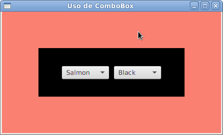

# ComboBox e ChoiceBox

Nesse capítulo também sobre controles, vamos falar das caixas de combinação, **ComboBox**, e caixas de escolhas, **ChoiceBox**. Ambas permitem você escolher um valor entre um conjunto de opções.

### Muitas opções, uma possível escolha

Os dois controles que vamos apresentar hoje funcionam de maneira muito semelhante, a maior diferença está na forma visual que elas são apresentadas dentro da sua aplicação. Ambas permitem que você faça a escolha de uma só opção entre diversas outras. no entanto, há uma pequena diferença visual entre elas e o **ComboBox** permite que você fabrique as células que serão mostradas. Criar fábrica de células é um assunto que facilmente ocuparia um capítulo inteiro, vamos deixar isso para outra hora.
Para tratar dos dados individualmente da parte visual, usamos em ambas classes o conceito de **SelectionModel**, onde abstraimos a parte de seleção de dados. Temos duas abstrações: **MultipleSelectionModel** (permite selecionar vários itens ao mesmo tempo) e **SingleSelectionModel** (permite selecionar um único item ao mesmo tempo.
Hoje também vamos falar de um conceito novo e específico do JavaFX, então vamos nos limitar a mostrar o ComboBox e uma aplicação super simples, no entanto, o leitor deve pode acessar a documentação *JavaDoc* do ChoiceBox e criar a mesma aplicação usando ele. Enfim, vamos ao código!

### Selecione a cor
Para demostrar o **ComboBox**, criamos uma aplicação bem simples que permite que você selecione a cor da cena e de um retângulo através do uso desse controle de interface. Ao selecionar a cor, a mudança já é imediata. Como fazemos isso? Confira o código e em seguida tenha acesso a uma explicação rápida:

```java
package javafxpratico;

import javafx.application.Application;
import javafx.geometry.Pos;
import javafx.scene.Scene;
import javafx.scene.control.ComboBox;
import javafx.scene.layout.HBox;
import javafx.scene.layout.StackPane;
import javafx.scene.paint.Color;
import javafx.scene.shape.Rectangle;
import javafx.stage.Stage;

public class TestandoComboBox extends Application {

	String cores[] = { "Blue", "Black", "Red", "White", 
	    "Green", "Yellow", "Gray", "Pink", "Salmon" };

	public static void main(String[] args) {
		launch();
	}

	@Override
	public void start(Stage palco) throws Exception {
		StackPane raiz = new StackPane();

		HBox opcoes = new HBox(10);
		opcoes.setAlignment(Pos.CENTER);

		final Rectangle retangulo = new Rectangle(300, 100);
		final Rectangle fundo = new  Rectangle(450, 250);
		
		ComboBox<String> cbCorCena = new ComboBox<>(); // 1
		ComboBox<String> cbCorRetangulo = new ComboBox<>();

		cbCorCena.getItems().addAll(cores); // 2
		cbCorRetangulo.getItems().addAll(cores);

		opcoes.getChildren().addAll(cbCorCena, cbCorRetangulo);

		raiz.getChildren().addAll(fundo, retangulo, opcoes);

		final Scene cena = new Scene(raiz, 450, 250);
		palco.setTitle("Uso de ComboBox");
		palco.setScene(cena);
		palco.show();
		// 3
		cbCorCena.getSelectionModel().selectedItemProperty().addListener(
			(valorObservado, valorAntigo, valorNovo) -> {
			    // 4
				fundo.setFill(Color.valueOf(valorNovo));
		});
		cbCorRetangulo.getSelectionModel().selectedItemProperty()
				.addListener((valorObservado, valorAntigo, valorNovo) -> {
					retangulo.setFill(Color.valueOf(valorNovo));
				});
		cbCorCena.getSelectionModel().select(0); // 5
		cbCorRetangulo.getSelectionModel().select(1);
	}
}
```

1. Começamos instanciando uma **ComboBox**. Perceba que ela faz uso de genéricos, onde informamos que tipo de dado serão os itens contidos nela, no nossa caso, String;
2. Nessa linha adicionamos os itens. Isso é feito de forma semelhante com a qual adicionamos itens a um componente pai como o **Group**, **VBox**, **HBox**, entre outros. Nesse caso estamos adicionando uma lista de Strings, pois esse é o tipo aceitado por essa combobox;
3. Para observar quando o usuário escolhe algum valor no Combobox, adicionamos um ouvinte ao valor observável a propriedade do item selecionado. Isso pode parecer bastante estranho, mas em breve você vai se acostumar. JavaFX traz uma API com atributos diferentes, onde nós podemos observar as modificações feitas nesses atributos e tomar alguma ação. Novamente isso é feito através de Listeners, no nosso caso usamos um listener de mudança, o **ChangeListener**. Note que o uso dele é bastante semelhante ao uso dos listeners de botões. Em resumo, nós estamos observando o valor selecionado do combox através de um listener, quando ele muda, nós trocamos a cor de fundo da cena e usamos a sintaxe das expressões lambda para simplificar;
4. A classe Color do JavaFX é bastante interessante e contém muito mais do que um aglomerado de constantes para definir cores. É possível também converter o valor de texto de uma cor para um objeto **Color**. É isso o que fazermos aqui;
5. Por fim nós usamos o método select do modelo de seleção para escolher uma cor. Esse método equivale a ação de um usuário ao escolher uma cor na combobox usando a sua aplicação, ou seja, isso também vai disparar o ouvinte de mudança que falamos na explicação 3.


Por fim, essa é a aplicação resultante:



