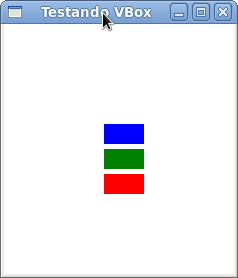
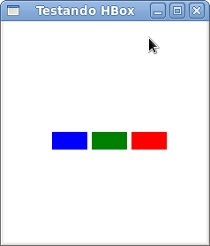
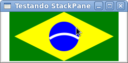

# Gerenciando Layout: HBox, VBox e StackPane

Organizar os componentes que estão em uma aplicação gráfica é sempre um desafio, pois você tem que posicionar e dimensionar cada elemento que adicionar a sua aplicação. Os gerenciadores de leiaute(ou layout, você decide) servem para auxiliar você nessa missão.

O JavaFX traz alguns gerenciadores pronto para auxiliar você. Nesse capítulo vamos começar a falar dessa API, no entanto, vocë deve ter percebido o uso de alguns em capítulos anteriores.

### O que é um gerenciador de leiaute?

O conceito é bem simples. Quando você vai criar sua aplicação, a "telinha" dela, você tem necessidades comuns de posicionamento e dimensionamento dos componentes. Exemplo: as vezes você quer colocar eles alinhados verticalmente ou horizontalmente, quer empilhar, colocar em uma "grade" e por aí vai. Fazer isso na mão já é difícil e ainda teremos que recriar o código para cada nova aplicação que escrevermos...
Um gerenciador de leiaute é uma classe que faz esse gerenciamento para você de acordo com uma forma de posicionamento já estabelecida. Em termos práticos, a classe **VBox**, por exemplo, organiza os componentes verticalmente e podemos adicionar nela os componentes de nossa aplicação como os botões, rótulos, tabelas, ou até outros gerenciadores de leiaute. As principais classes do JavaFX que exercem essa função são:

* **VBox:** Alinha os componentes verticalmente;
* **HBox:** Alinha os componentes horizontamente;
* **StackPane:** Empilha um componente sobre o outro;
* **BorderPane:** Divide os elementos em regiões e coloca um componente em cada uma desses regiões
* **FlowPane:**  Ajeita os componentes de acordo com uma orientação e com o fluxo da aplicação;
* **GridPane:** Cria uma grade com os componentes. É possível informar qual a posição do componente na grade;
* **AnchorPane:** Os componentes filhos são "ancorados"  em uma parte do painel;
* **TilePane:** Um painel com pedaços (Tile vem do inglês e significa azulejo) para os componentes semelhante ao GridPane, mas permite tratamento dos "Tiles";

Todas essas classes estão no pacote *javafx.scene.layout*.

### Arquitetura

Como você já deve ter percebido, essas os gerenciadores aceitam classes que herdam de Node e os próprios são Nodes também. Eles estendem diretamente de **Pane** cujo método mais comum é *getChildren*.

O método *getChildren()* retorna os elementos filhos em uma **ObservableList**. Essas listas simplesmente atualizam automático a visualização quando adicionamos componentes nela. Com ela podemos adicionar os componentes um a um, usando um array ou simplesmente adicionar quantos elementos quiser na chamada do método. Métodos mais comuns da ObservableList são:

* **addAll(E... elements):** adiciona 1 ou mais elementos em uma só chamada de método. Você pode passar vários elementos também ou até um array. É possível adicinar um único componente usando o método add;
* **removeAll:** remove todos os elementos da lista; Com o método remove, é possível remover um componente de um determinado índice ou um objeto informado.
* **setAll (E... elements):** remove os elementos anteriores e adiciona os novos informados; Temos também o método set onde é possível "setar" o nó de um determinado índice.

Há outros métodos. As listas observáveis são poderosas classes do mundo JavaFX, no entanto, esses são os mais usados frequentemente. Lembre-se que essa lista é tipada para Node, o que significa que você só pode adicionar elementos desse tipo ou subclasses de Node e também reforçando que mexer na lista já garante que a sua aplicação seja atualizada.


### Conhecendo na prática

Depois de tanto conceito e uma pequena exploração da API, vamos criar aplicações simples que usam essas classes e dessa forma vamos ver em ação tudo que falamos, tornando mais prazeroso o aprendizado e a exploração da API. Hoje vamos mostrar só três classes: **VBox**, **HBox** e **StackPane**.

#### VBox
Um dos gerenciadores mais simples, a classe VBox simplesmente alinha os componentes verticalmente e permite determinar o espaçamento entre eles e ainda o alinhamento. Abaixo um código que simplesmente adiciona umas forma geométricas a uma VBox e em seguida a explicação do mesmo.

```java
package javafxpratico;

import javafx.application.Application;
import javafx.geometry.Pos;
import javafx.scene.Scene;
import javafx.scene.layout.VBox;
import javafx.scene.paint.Color;
import javafx.scene.shape.Rectangle;
import javafx.stage.Stage;

public class PraticaVBox extends Application {
	
	public static void main(String[] args) {
		launch(args);
	}

	@Override
	public void start(Stage stage) throws Exception {
		VBox caixaVertical = new VBox(); // 1
		caixaVertical.setSpacing(5); // 2
		caixaVertical.setAlignment(Pos.CENTER); // 3

		// 4
		caixaVertical.setTranslateX(10);
		caixaVertical.setTranslateY(20);

		// 5
		Rectangle retanguloAzul = new Rectangle(40, 20);
		Rectangle retanguloVerde = new Rectangle(40, 20);
		Rectangle retanguloVermelho = new Rectangle(40, 20);

		retanguloAzul.setFill(Color.BLUE);
		retanguloVerde.setFill(Color.GREEN);
		retanguloVermelho.setFill(Color.RED);

		// 6
		caixaVertical.getChildren().addAll(retanguloAzul, retanguloVerde, retanguloVermelho);
		stage.setScene(new Scene(caixaVertical, 230, 250));
		stage.show();
		stage.setTitle("Testando VBox");
	}

}
``` 

1. Criando nossa VBox. Não estamos enviando nada no construtor, mas é possível informar o espaçamento entre os componentes diretamente no construtor;
2. Informamos o espaçamento. Esse atributo é do tipo Double e ele informa qual distância os componentes devem entre eles;
3. Aqui determinamos que os componentes fiquem centralizados no nosso VBox. Podemos também escolher colocar eles para esquerda, direta, entre outros. Veja o enum Pos.
4. Nessa linha mudamos a posição X e Y do nosso VBox. O interessante é que os componentes filhos terão que obedecer a posição do pai, para isso eles também são deslocados automaticamente;
5. Criamos nossos componentes que estarão no VBox. Criamos retângulos e lembrando que eles herdam de Node. Isso é um requisito para nosso gerenciador.
6. Agora adicionamos todos de uma vez. A ordem de adicão é a ordem que eles serão mostrados na aplicação. 

O resultado está abaixo. Lembre-se de sempre fuçar bastante as classes, essa é a melhor forma de aprender e se diverter :)



#### HBox
Não iremos entrar em detalhes dessa classe por que ela trabalha exatamente igual a VBox, com exceção que ela alinha os componentes horizontalmente. Abaixo temos uma imagem de como o código acima se comportaria simplesmente trocar a "instanciação" de VBox para HBox.



#### StackPane
Um comportamento não muito comum, mas que pode ser útil em diversas aplicações, é o trazido pela classe **StackPane**. Nela os componentes são empilhados uns nos outros, ou seja, quem entrou primeiro fica embaixo do segundo e assim por diante. O exemplo de código abaixo mostra isso muito claramente. Perceba que não iremos explicar o código pois ele é semelhante ao mostrado anteriormente, a exceção está no resultado visual. Estamos desenhando uma bandeira do Brasil (ou tentando), para isso criamos um retângulo, um losango um círculo e, o mais díficil, um arco. Usamos as formas geométricas do JavaFX para fazer isso e no fim colocamos em um gerenciador do tipo StackPane, veja que ele empilha as imagens de forma que por final temos algo que é quase uma bandeira do Brasil... Quase...

```java
package javafxpratico;

import javafx.application.Application;
import javafx.scene.Scene;
import javafx.scene.layout.StackPane;
import javafx.scene.paint.Color;
import javafx.scene.shape.ArcTo;
import javafx.scene.shape.Circle;
import javafx.scene.shape.MoveTo;
import javafx.scene.shape.Path;
import javafx.scene.shape.Polygon;
import javafx.scene.shape.Rectangle;
import javafx.stage.Stage;

public class PraticaStackPane extends Application {
	
	public static void main(String[] args) {
		launch(args);
	}

	@Override
	public void start(Stage palco) throws Exception {
		StackPane painelEmpilhador = new StackPane();
		Rectangle retangulo = new Rectangle(220, 120);
		retangulo.setFill(Color.GREEN);

		Polygon losango = new Polygon();
		losango.getPoints().addAll(new Double[]{
		     50.0, 50.0,
		     150.0, 0.0,
		     250.0, 50.0,
		     150.0, 100.0,
		     50.0, 50.0 });
		losango.setFill(Color.YELLOW);
		Path arco = new Path();
		MoveTo moveTo = new MoveTo();
		moveTo.setX(0.0);
		moveTo.setY(0.0);

		ArcTo arcTo = new ArcTo();
		arcTo.setX(55.0);
		arcTo.setY(0.0);
		arcTo.setRadiusX(50.0);
		arcTo.setRadiusY(50.0);

		arco.getElements().add(moveTo);
		arco.getElements().add(arcTo);
		arco.setStroke(Color.WHITE);

		arco.setRotate(180);
		arco.setStrokeWidth(5);

		Circle circulo = new Circle(30, Color.BLUE);
		  
		painelEmpilhador.getChildren().addAll(retangulo, losango, circulo, arco);
		
		Scene cena = new Scene(painelEmpilhador, 250, 100); 
		palco.setTitle("Testando StackPane"); 
		palco.setScene(cena); 
		palco.show(); 
	}

}
```

Mais uma vez note que a ordem que adicionamos os componentes é muito importante. Veja o resultado:

