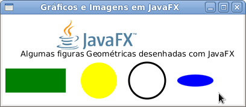

# Mostrando Imagens e Figuras Geométricas


### Mostrando Imagens

Um dos ponto mais interessantes do JavaFX é como ele facilitou a criação de aplicações, assim podemos fazer algumas coisas antes dificeis da forma mais fácil possível.

Um exemplo é carregar imagens na aplicação. Temos somente dois passos a serem seguidos nosse caso:

* **Carregar a imagem**: Para isso usamos a classe **javafx.scene.image.Image**. Perceba que essa classe é uma representação alto nível de uma imagem, sendo que a mesma pode vir de um **java.io.InputStream**, um arquivo do seu computador e até mesmo um endereço da internet, sem você se preocupar com qualquer outra coisa;
* **Mostrar a imagem**: Visualizamos a imagem através da classe **javafx.scene.image.ImageView**. Repetimos o mesmo discurso para dizer que ImageView é um Node e é ele que adicionamos à nossa aplicação, aplicamos efeitos, animações etc (calma, iremos mostrar tudo isso em breve).
Após saber disso, você entenderá perfeitamente que com três linhas de código podemos ter uma imagem em uma aplicação JavaFX. Mas código só daqui a pouco :)

### Forma Geométricas

Todas as formas geométricas do JavaFX, adivinhe, também são Nodes e podem sofrer efeitos, transformações e animações, além de ter diversas propriedades em comum. Você pode ver as figuras geométricas oferecidas pelo JavaFX no pacote **javafx.scene.shape**. Todas as figuras geométricas herdam de **javafx.scene.shape.Shape** (que por sua vez herda de... Node), portanto temos propriedades comuns só para as figuras geométricas, entre as quais destacamos:

* **fill**: O preenchimento da figura geométrica. Esse é um parâmetro do tipo Paint, que representa ou uma cor simples(exato: azul, verde, rosa...) ou um gradiente complexo;
* **stroke**: Também do tipo **javafx.scene.paint.Paint**, mas se aplica a linha que envolve a forma geométrica;
* **strokeWidth**: A largura da "stroke".


### Hora do Código

Ufa, hora de se divertir. No código atual iremos mostrar a carga de uma imagem e algumas figuras geométricas, ficando a seu cargo baixar o projeto anexado e fazer algo mais elaborado e divertido. Se formos explorar todas as propriedades de cada forma geométrica, estaríamos sendo redundantes, verbosos e chatos e programação se aprende com ação e não exposição :) Após o código, temos uma explicação linha a linha de tudo que é feito.

*Usando o projeto anterior, crie uma classe chamada ImagemFigurasGeometricas no pacote javafxpratico*

```java
package javafxpratico;

import javafx.application.Application;
import javafx.scene.Group;
import javafx.scene.Scene;
import javafx.scene.image.Image;
import javafx.scene.image.ImageView;
import javafx.scene.paint.Color;
import javafx.scene.shape.Circle;
import javafx.scene.shape.Ellipse;
import javafx.scene.shape.Rectangle;
import javafx.scene.text.Text;
import javafx.stage.Stage;

public class ImagemFigurasGeometricas extends Application {

	private final String IMG_URL = "http://www.oracle.com/ocom/groups/public/@otn/documents/digitalasset/402460.gif";

	public static void main(String[] args) {
		launch();
	}

	@Override
	public void start(Stage palco) throws Exception {
		Image imagem = new Image(IMG_URL); // 1
		ImageView visualizadorImagem = new ImageView(imagem); // 2
		visualizadorImagem.setTranslateX(80); // 3
		visualizadorImagem.setTranslateY(5); // 4

		Text textoInformativo = new Text("Algumas figuras Geométricas desenhadas com JavaFX");
		textoInformativo.setTranslateX(30);
		textoInformativo.setTranslateY(70);

		Rectangle retangulo = new Rectangle(100, 40); // 5
		retangulo.setTranslateX(5);
		retangulo.setTranslateY(90);
		retangulo.setFill(Color.GREEN); // 6

		Circle circulo = new Circle(30);
		circulo.setTranslateX(160);
		circulo.setTranslateY(110);
		circulo.setFill(Color.YELLOW);

		Circle circuloBranco = new Circle(30);
		circuloBranco.setTranslateX(240);
		circuloBranco.setTranslateY(110);
		circuloBranco.setStroke(Color.BLACK); // 7
		circuloBranco.setStrokeWidth(3.0); // 8
		circuloBranco.setFill(Color.WHITE);

		Ellipse elipse = new Ellipse(30, 10);
		elipse.setTranslateX(320);
		elipse.setTranslateY(110);
		elipse.setFill(Color.BLUE);

		Group componentes = new Group(); // 9
		componentes.getChildren().addAll(visualizadorImagem, textoInformativo, retangulo, circulo, circuloBranco,
				elipse); // 10
		Scene cena = new Scene(componentes, 400, 150);
		palco.setTitle("Gráficos e Imagens em JavaFX");
		palco.setScene(cena);
		palco.show();
	}
}
```
1. Nessa linha carregamos nossa imagem usando uma URL da internet. Lembrando que essa não é a única maneira, podemos também usar um arquivo ou qualquer coisas que forneça um InputStream;
2. Agora criamos o nó da imagem e informamos que imagem será mostrada no construtor;
3. Usamos uma propriedade nova nessa linha e ela nem é só do ImageView, é da classe Node! Com o *translateX* informamos a posição X(imagine o posicionamento como um plano cartesiano) de um componente no pai. O método set serve para configurar um valor, você já viu o uso dele em classes como o Stage;
4. Fazemos o mesmo descrito em 3, mas agora para a posição Y. ATENÇÃO: Posicionar componentes assim não é legal de ser feito em aplicações grandes, vamos mostrar em breve os gerenciadores de leiaute do JavaFX;
5. Aqui já estamos criando uma forma geométrica, um Retângulo (**Rectangle**). De acordo com a forma criada, teremos parâmetros que devem ser informados. No caso do retângulo, informamos a largura e a altura;
6. Mudamos a cor padrão da forma geométrica (preta) para verde. Note que aqui usamos uma constante da classe **javafx.scene.paint.Color**;
7. É informado a cor da linha que envolve essa forma geométrica, nesse caso: preta;
8. Também aumentamos a largura (ou grossura) da linha;
9. Outra novidade nesse código: a classe **javafx.scene.Group**. Como o próprio nome disse, usamos ela para agrupar outros nós(classes que herdam de **javafx.scene.Node**). Ela é um nó de nós, ou seja, podemos aplicar efeito, animar, transformar que isso será aplicado a todos os nós;
10. Finalmente usamos um novo método dos filhos do grupo que é adicionar todos os nossos nós de uma vez. Podemos fazer isso, ou adicionar um por um.

Por fim, ao executear o código acima, isso é o que deveria aparecer:


