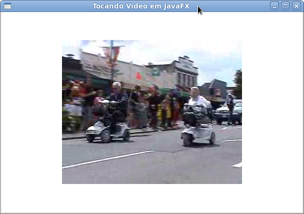

# Tocando Vídeo

Tocar vídeo em JavaFX é tão simples que chega a assustar quem já tentou tocar um vídeo usando Java. Nós só temos que seguir três pequenos passos:

* **Carregar**: Você primeiramente deve carregar a mídia que vai tocar. A mídia pode estar no seu disco rígido como em um um servidor remoto(carregando assim através da sua URL);
* **Tocar**. A partir da mídia, você deverá controlar a mesma: tocar, parar, pausar...
* **Mostrar**: Nesse ponto iremos colocar o vídeo dentro de sua aplicação JavaFX.


Para realizar esses três passos temos três classes JavaFX que ficam no pacote **javafx.scene.media**. Para 1 nós temos a classe **Media**, 2 podemos fazer com a classe **MediaPlayer** e finalmente conseguimos o passo três com o uso da **MediaView**. O uso dessas classes é muito simples, abaixo temos o código de um aplicação de exemplo e em seguida um breve explicação de cada linha nova. Se você quiser testar, crie uma classe chamada **TocandoVideo** no mesmo projeto que já criamos e cole o código abaixo - note que a execução pode levar uns segundos já que ele baixa um arquivo da internet:

```java
package javafxpratico;

import javafx.application.Application;
import javafx.scene.Scene;
import javafx.scene.layout.StackPane;
import javafx.scene.media.Media;
import javafx.scene.media.MediaPlayer;
import javafx.scene.media.MediaView;
import javafx.stage.Stage;

public class TocandoVideo extends Application {

	// Vídeo de exemplo pego desse site: http://www.mediacollege.com/adobe/flash/video/tutorial/example-flv.html
	private String VIDEO_URL = "http://www.mediacollege.com/video-gallery/testclips/20051210-w50s.flv";
	
	public static void main(String[] args) {
		launch();
	}

	@Override
	public void start(Stage palco) throws Exception {

		Media media = new Media(VIDEO_URL); // 1
		MediaPlayer mediaPlayer = new MediaPlayer(media); // 2
		MediaView mediaView = new MediaView(mediaPlayer); // 3

		StackPane raiz = new StackPane();
		raiz.getChildren().add(mediaView); // 4
		Scene cena = new Scene(raiz, 600, 400);
		palco.setTitle("Tocando Video em JavaFX");
		palco.setScene(cena);
		palco.show();

		mediaPlayer.play(); // 4
	}
}
```

1. Nessa linha estamos carregando o nosso vídeo. No construtor é recebido a URL do vídeo que pode ser ou um arquivo local ou um link para um vídeo publicado em algum servidor;
2. Após informar a mídia, nós temos que criar um player ("tocador") que será responsável por interagir com a midia em sí e assim poder tocar, parar, pausar (entre outras ações) o referido vídeo;
3. Nós já temos o vídeo e já sabemos como controlar ele, no entanto, temos que adicionar ele a nossa aplicação JavaFX para que o vídeo seja mostrado. 
4. O **MediaView** é uma classe que herda de  Node, ou seja, podemos adicionar ele a qualquer Node que herda de Parent (não se preocupe, futuramente teremos posts específicos sobre essas classes). Nessa linha nós adicionamos o vídeo ao pai;
5. Por fim tocamos o vídeo através do método *play()*. Há também outros métodos para controle do vídeo, sendo possível criar um player dinâmico...

Conforme mostrado acima, são quatro linhas para podermos tocar um vídeo em uma aplicação JavaFX. Veja abaixo o resultado:



No futuro, quando você aprender mais sobre JavaFX, você pode voltar para essa mesma aplicação e fazer melhorias: adicionar botões de controle, permitir usuário escolher a URL do vídeo e por aí vai.