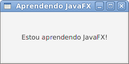

# Um "Olá Mundo" com JavaFX

Nesse primeiro artigo vamos mostrar um passo a passo de como executar sua primeira aplicação usando JavaFX! A versão usada é a que vem no Java 8. 

*Antes de prosseguir, confira se você instalou o JDK 8 da Oracle corretamente na sua máquina e também o Eclipse!*

Ótimo! Já temos tudo o que precisamos. O próximo passo agora é abrir o Eclipse e criar um projeto do tipo **Maven Project**. Nesse projeto iremos criar um pacote e nele uma classe Java. Veja abaixo uma explicação mais detalhada (nomes em negrito e itálico entre parêntesis foram os que eu usei):

1. Acesse o menu ***File -> New -> Maven Project***, marque a opção "Create a simple project (skip archetype selection)", preencha os valores para **groupId**(***org.javafxpratico***), **artifact-id**(***javafx-pratico***), **version**(***1.0***)  e clique em **Finish**;
2. Clique com o botão direto sobre o seu projeto e acesse o menu ***New -> Package***, dê um nome (***javafxpratico***) e em seguida clique em **Finish**;
3. Clique com o botão direito no pacote main e acesse o menu ***New -> Class***. Dê um nome para a classe (eu usei ***OlaMundoJavaFX***) e clique em **Finish**.


Pronto! É nesse mesmo projeto que iremos explorar o JavaFX. O código da classe OlaMundoJavaFX deve se parecer com o seguinte:

```java
package javafxpratico;

import javafx.application.Application;
import javafx.scene.Scene;
import javafx.scene.control.Label;
import javafx.scene.layout.StackPane;
import javafx.stage.Stage;

public class OlaMundoJavaFX extends Application { // 1

	public static void main(String[] args) {
		launch(); // 2
	}

	@Override
	public void start(Stage palco) throws Exception { // 3
		StackPane raiz = new StackPane(); // 4
		Label lblMensagem = new Label(); // 5

		lblMensagem.setText("Estou aprendendo JavaFX!"); // 6
		raiz.getChildren().add(lblMensagem); // 7

		Scene cena = new Scene(raiz, 250, 100); // 8
		palco.setTitle("Aprendendo JavaFX"); // 9
		palco.setScene(cena); // 10
		palco.show(); // 11

	}
}
```

Essa é uma das aplicações mais básicas que você pode fazer com JavaFX! Você pode executa-la clicando em ***Run*** ou clicando com o botão direito em cima dela e escolher no menu o seguinte: ***Run As -> Java Application***. Se fizer tudo certinho a seguinte janela irá aparecer:




Ótimo! Sua primeira aplicação. Vocë deve ter notado que o código acima está com comentários numéricos. Isso foi proposital, pois aqui vai a explicaÇão desse código aí! Preste bastante atenção pois esse mesmo cõdigo é usado em todas as aplicações JavaFX!


1. Perceba que a classe principal herda de **javafx.application.Application**. **TODA** classe principal de JavaFX deve herdar de Application e implementar o método start;
2. No método *main* chamamos o método *lunch* para começar a nossa aplicação. Aqui não vai código JavaFX, o código vai no método start (notem que no JavaFX 8 isso é mais necessário, abaixo mais detalhes);
3. A implementação do método *start*, herdado da classe Application. O atributo recebido é do tipo **javafx.stage.Stage**. Sendo direto, podemos ver o Stage (palco) como o frame, a janela da nossa aplicação, mas na verdade ele não pode ser representado sim se pensarmos nos diversos dispositivos que podem rodar(em um futuro próximo) JavaFX: Celulares, televisores, "tablets", etc;
4. Nesse ponto nós criamos um elemento chamado "pai", pois permite adicionarmos outras coisas dentro dele. No nosso caso, o **javafx.scene.layout.StackPane** permite adicionar vários elementos os quais tem seu leiaute de pilha, ou seja, eles serão empilhados um sobre o outro. No futuro falaremos mais sobre isso, mas lembre-se que tudo no JavaFX é um nó, ou seja, herda da classe **Node**;
5. Não há nada de mais aqui, simplesmente criamos um objeto do tipo **javafx.scene.control.Label**, que é um controle de interface para mostrar texto. Ponto;
6. Aqui informamos o texto que o Label irá mostrar. Note que isso poderia ter sido feito pelo construtor, na criação do Label;
7. Como o StackPane é um elemento pai, ele também tem elementos filhos. Nessa linha de código, recuperamos os filhos dele(*getChildren()*) e adicionamos nosso Label(*add(Node)*), fazendo que o Label seja um filho dele;
8. É hora de aprender outro conceito do JavaFX. Nessa linha criamos uma **javafx.scene.Scene**(cena). Uma cena é o contâiner principal de todos os elementos do JavaFX e na criação dela aproveitamos para informar a raiz (como o nome diz, a raiz de todos os componentes), largura e altura da cena;
9. Agora vamos voltar a mexer com nosso palco. Nessa linha informamos o título dele, no nosso caso atual, o título da janela que será mostrada;
10. O palco precisa de uma cena, simplesmente é isso que é feito nessa linha.
11. Simplesmente mostrando o palco! Se esse método não for chamado, nada irá acontecer quando executar esse código.

Pronto! Muita coisa nova, né? Mas não desista, no decorrer dos artigos você vai ficando cada vez mais confortável com JavaFX e seus componentes!